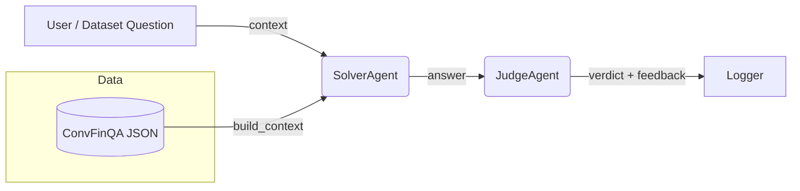

# Tomoro: Modular Multi-Agent Conversational Financial QA

## Overview

Tomoro is a modular, multi-agent large-language-model (LLM) system for conversational question answering over financial documents based on the **ConvFinQA** benchmark.
It pairs a context-aware *Solver* with a semantic *Judge* to deliver accurate, explainable answers – and logs everything so you can benchmark accuracy, latency, and cost.

* **Multi-agent** – decoupled *Solver*, *Judge*, and *Dataset* agents.
* **Semantic evaluation** – Judge tolerates equivalent numeric formats (e.g. 0.2 ≡ 20 %).
* **First-class metrics** – produces CSVs with runtime, throughput, and accuracy.
* **Plug-and-play models** – swap any OpenAI-compatible chat model with one line.

---

## Architecture



### Agents

| Agent              | Role                                                                                |
| ------------------ | ----------------------------------------------------------------------------------- |
| **SolverAgent**    | Generates an answer from pre-text + table + post-text and the conversation history. |
| **JudgeAgent**     | Decides whether the answer is correct given the ground truth and explains mistakes. |
| **ConvFinQAAgent** | Orchestrates Solver → Judge, aggregates metrics, writes `convfinqa_results.csv`.    |

---

## Benchmark Summary

### Judge LLM Selection

| Model                           |    FP |    FN | Accuracy | Avg latency |
| ------------------------------- | ----: | ----: | -------: | ----------: |
| meta-llama/llama-3-70b-instruct | **0** | **1** | **99 %** |       196 s |
| mistralai/mixtral-8x7b-instruct |     0 |     5 |     95 % |    **73 s** |
| mistralai/mistral-7b-instruct   |     0 |    12 |     88 % |       294 s |
| gpt-4o-mini                     |     0 |    25 |     75 % |       118 s |

### Solver LLM Performance (100 conversations)

| Model                  |   Turn acc | Conv-mean | Fully-correct convs | Avg turn latency | Throughput (turn/s) |
| ---------------------- | ---------: | --------: | ------------------: | ---------------: | ------------------: |
| meta-llama-3-70B-instr | **75.1 %** |    75.4 % |                48 % |           7.21 s |               0.139 |
| gpt-4o-mini            |     68.5 % |    66.7 % |                36 % |       **3.36 s** |           **0.298** |
| mixtral-8×7B-instr     |     51.7 % |    51.1 % |                19 % |           3.50 s |               0.286 |

`gpt-4o-mini` strikes the best latency/accuracy trade-off for production, while `llama-3-70B-instr` is preferred when evaluation accuracy matters most.

---

## Quick-start

### 1. Clone & install

```bash
git clone https://github.com/<your-org>/tomoro.git
cd tomoro
pip install -e .
# or: poetry install
```

### 2. Configure environment

Add a `.env` file (or real env-vars) with at least:

```dotenv
OPENAI_API_KEY=sk-...
```

You can also set:

```dotenv
SOLVER_MODEL=gpt-4o-mini
JUDGE_MODEL=meta-llama/llama-3-70b-instruct
```

### 3. Run a demo

```bash
python run_convfinqa.py --sample_size 10
```

The script prints per-turn logs and writes aggregated metrics to **convfinqa\_results.csv**.

---

## Reproducing the paper numbers

```bash
# 100-conversation benchmark (≈15 min on GPU for the judge model)
python run_convfinqa.py --sample_size 100
```

Tune `SolverAgent` / `JudgeAgent` parameters in `convfinqa/agents/*_agent.py`.

---

## Project Layout

```
convfinqa/
├── agents/               # Solver + Judge class definitions
├── dataset/              # FinQADataset loader & helpers
├── prompts/              # System prompts & few-shot examples
├── tests/                # Pytest unit tests
├── data/                 # Downloaded ConvFinQA JSON
└── run_convfinqa.py      # Main entry-point
```

---

## Running the tests

```bash
pytest
```

---

## Configuration

* Override model names via env-vars (`SOLVER_MODEL`, `JUDGE_MODEL`) or by passing `model=...` when instantiating agents.
* Adjust temperature, max tokens, etc., in the agent constructors.
* To target a smaller subset of data, set `sample_size` on `ConvFinQAAgent`.

---

## Roadmap

* 🔢 **Calculator tool** for explicit numerical reasoning.
* 🤖 **Ensemble routing**: confidence-based fallback to larger models.
* 📚 **General-domain RAG** for unstructured multi-doc questions.


